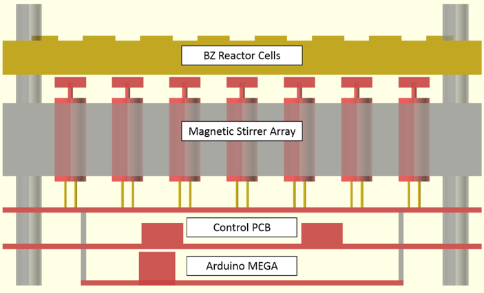

# BZ-CA

Platform to physically embody cellular-automaton using Belousov-Zhabotinsky
reaction-diffusion chemistry in addressably stirred cells.

## Aims of project
* Create working platform of addressable magnetic stirrers
* Use platform to demonstrate control over cell oscillations
* Control patterns of oscillating cell arrays using machine learning


## Platform
BZ-CA has a working stirrer array. Some further testing is needed.

#### ELECTRONICS:
* Electronic control consists of:
 * 2 x [Adafruit 6-Channel 12-bit PWM/Servo Shields](https://www.adafruit.com/products/1411)
 * Modified EVOPROG inhouse shield
 * 4 x [ULN2803A](http://www.ti.com/lit/ds/symlink/uln2803a.pdf) Darlington Transistor Arrays
 * Benchtop power supply
 * (NOT PC power supply, cuts out due to motors' unregulated current draw)

#### DONE:
* Magnetic stirrers assembled and tested
* Stirrer array mount and reaction arena 3D printed
* Stirrers tested in assembled rig
 * Stirs stirrer beads in water
 * Stirring speed controllable

#### TODO:
* Test stirrers with new magnet mounts
* Stop power oscillation
* Determine minimum speed for each motor
* Test working platform with BZ chemistry
* Design bespoke PCB to allow stackable platform:




## Software
BZ-CA has working control software.

#### DONE:
* Control software written: [bzboard.py](software/bzboard/bzboard.py)
 * Uses SerialCommandHandler from [commanduino](https://github.com/croningp/commanduino)
* Control firmware written: [firmware_pwm_serial.ino](software/firmware/firmware_pwm_serial/firmware_pwm_serial.ino)
 * Uses [Adafruit_PWMServoDriver](https://github.com/adafruit/Adafruit-PWM-Servo-Driver-Library) library
* Both software and firmware tested and working

#### TODO:
* Calibrate motors to run at same speed
* Account for minimum speeds of motors when activating speeds
 * Dictionary of min speeds used to calculate rpm?


## Parts
A list of parts and where they were purchased is in the table below,
and in [part_links.csv](hardware/part_links.csv).

Part | url | Purchase url
--- | --- | ---
Motors | - | http://hobbycomponents.com/motors-and-servos/519-micro-coreless-6mm-x-14mm-motor
PWM shield | https://www.adafruit.com/products/1411 | https://shop.pimoroni.com/products/adafruit-16-channel-12-bit-pwm-servo-shield-i2c-interface
Stackable headers | - | https://shop.pimoroni.com/products/arduino-stackable-header-6-pin
Darlington transistor arrays | http://www.ti.com/lit/ds/symlink/uln2803a.pdf | Ask So
Arduino Mega | https://www.arduino.cc/en/Main/ArduinoBoardMega |
Magnets | - | http://www.first4magnets.com/circular-disc-rod-magnets-c34/2mm-dia-x-2mm-thick-n42sh-neodymium-magnet-0-15kg-pull-p3327#ps_1-1716


## Example Code
An example of how to use the bzboard.py code is provided below
and in [bzboard_test.py](software/tests/bzboard_test.py):

```python
# system imports
import time
import os, sys

# add path of bzboard.py, relative to /bz_ca/tests
lib_path = os.path.abspath(os.path.join('..', 'bzboard'))
sys.path.append(lib_path)
# then load module
import bzboard

# link to config file
SETUP_CONFIG_FILE = './bzboard_config_test.json'
# link to pattern file
PATTERN_FILE = './pattern_test.json'

# load config file in BZBoard
bz = bzboard.BZBoard.from_configfile(SETUP_CONFIG_FILE)

# activate each motor for 0.5 seconds each
for m in bz.motors:
    bz.activate(m)
    time.sleep(0.5)
    bz.deactivate(m)

# load and run a pattern from pattern file
file_pattern = bz.pattern_from_file(PATTERN_FILE)
bz.activate_pattern(file_pattern)
time.sleep(10)

# or manually set pattern
man_pattern = {
"A1":1,"A2":0,"A3":0,"A4":0,"A5":0,
"B1":0,"B2":1,"B3":0,"B4":0,"B5":0,
"C1":0,"C2":0,"C3":1,"C4":0,"C5":0,
"D1":0,"D2":0,"D3":0,"D4":1,"D5":0,
"E1":0,"E2":0,"E3":0,"E4":0,"E5":1
}
bz.activate_pattern(man_pattern)
time.sleep(10)

# all motors can be switched on/off
bz.activate_all()
time.sleep(5)
bz.deactivate_all()
```
